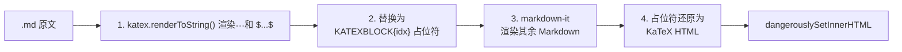

# KaTeX 公式渲染问题总结

## 问题现象

`Expected-Value-of-Dice.zh.md` 中的 LaTeX 数学公式无法正确渲染：不含 `\` 的简单公式（如 `$S$`、`$P_{S=i}$`）正常，但所有包含反斜杠命令的公式（`\frac`、`\text`、`\sum`、`\boxed` 等）均显示为原始文本。

## 根本原因

项目使用了 `markdown-it-katex@2.0.3` 作为 `markdown-it` 的 KaTeX 插件。该插件内嵌了 **`katex@0.6.0`**（2015 年的古董版本），而项目顶层安装的是 **`katex@0.16.47`**（截至修复时的最新版）。两个版本的 API 完全不兼容：

```
> npm ls markdown-it-katex katex
├── katex@0.16.47
└─┬ markdown-it-katex@2.0.3
  └── katex@0.6.0    ← 内嵌的过期版本
```

`markdown-it-katex` 使用其内嵌的 `katex@0.6.0` 渲染数学公式，该版本缺少对新式命令的支持且行为异常，导致几乎所有带反斜杠的公式渲染失败。

## 解决方案

**移除 `markdown-it-katex`，改为直接调用顶层 `katex` 渲染，通过占位符机制与 `markdown-it` 协同工作。**

### 渲染流程



### 核心代码

```typescript
// src/pages/projects/casino/games/StreetCrapsGame/StreetCrapsGame.tsx
import katex from 'katex';

function renderMarkdownWithKatex(md: ReturnType<typeof MarkdownIt>, text: string): string {
  const protectedBlocks: string[] = [];
  const MARK = 'KATEXBLOCK';

  // 1. 保护 $$...$$ 显示公式
  let processed = text.replace(/\$\$([\s\S]*?)\$\$/g, (_full, math) => {
    const html = katex.renderToString(math.trim(), {
      displayMode: true, throwOnError: false, strict: false,
    });
    const idx = protectedBlocks.length;
    protectedBlocks.push(html);
    return `${MARK}${idx}${MARK}`;
  });

  // 2. 保护 $...$ 内联公式
  processed = processed.replace(/\$(.+?)\$/g, (_full, math) => {
    const html = katex.renderToString(math.trim(), {
      displayMode: false, throwOnError: false, strict: false,
    });
    const idx = protectedBlocks.length;
    protectedBlocks.push(html);
    return `${MARK}${idx}${MARK}`;
  });

  // 3. markdown-it → 4. 还原
  let html = md.render(processed);
  const placeholderRe = new RegExp(`${MARK}(\\d+)${MARK}`, 'g');
  return html.replace(placeholderRe, (_full, idx) => protectedBlocks[Number(idx)]);
}
```

### 涉及文件

| 文件 | 改动 |
|------|------|
| `StreetCrapsGame.tsx` | 新增 `renderMarkdownWithKatex()`；移除 `markdown-it-katex` 导入 |
| `Expected-Value-of-Dice.zh.md` | 保持标准 LaTeX 单反斜杠语法 |
| `package.json` | `npm uninstall markdown-it-katex` |
| `vite-env.d.ts` | 移除 `declare module 'markdown-it-katex'` |

### 关键要点

1. **必须先用 KaTeX 渲染数学公式，再交给 markdown-it**——因为 markdown-it 会把 `\f`、`\t`、`\{` 等当做转义字符吃掉，导致 KaTeX 收到残缺内容。
2. **占位符必须是不会被 markdown-it 破坏的纯字母数字字符串**（如 `KATEXBLOCK0`），不能是 `\x00` 之类的控制字符（会被 strip）或 HTML 注释（可能在 markdown 转换中被移动/吞掉）。
3. **`.md` 文件中保持标准 LaTeX 语法**（`\frac`、`\text` 等），不需要翻倍反斜杠——因为 `vite ?raw` 导入将它们原样传入 JS 字符串，`katex.renderToString()` 直接处理即可。
